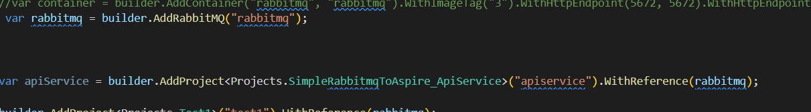
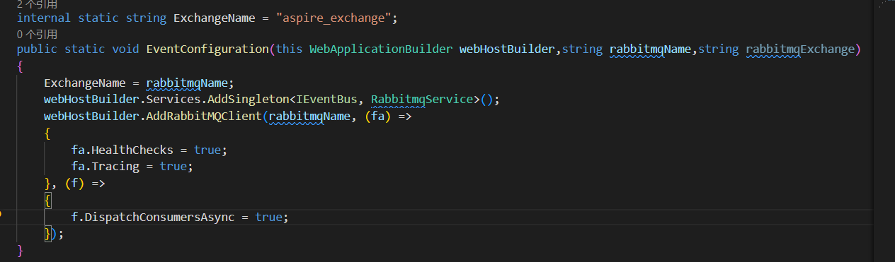
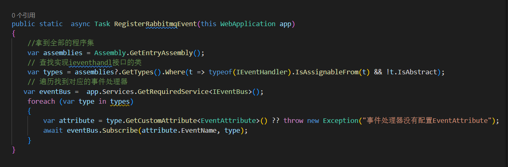
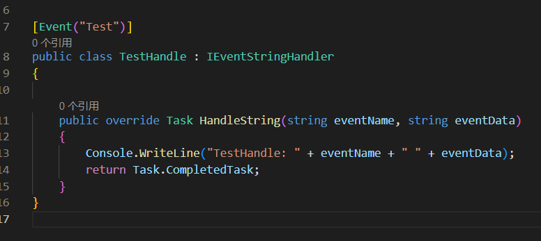

# Simple RabbitMQ Use In Aspire.NET

This is a simple FrameWork of how to use RabbitMQ in Aspire .NET .Asp.net core .

0. Install RabbitMQClint  on your Aspire.Host project and Add rabbitmq container
please verify your rabbitmq container is WithReference in your project
like this:

1. Install this framework on your project.

2. Add the ExtensionFunctions in your program.cs file.

3. Use IEventBus to publish  messages.

4. Use IEventHandler/IEventJsonHandler/IEventStringHandler to subscribe to messages.
in this framework,you should paste the EventAttribute in your event class.
like this:
